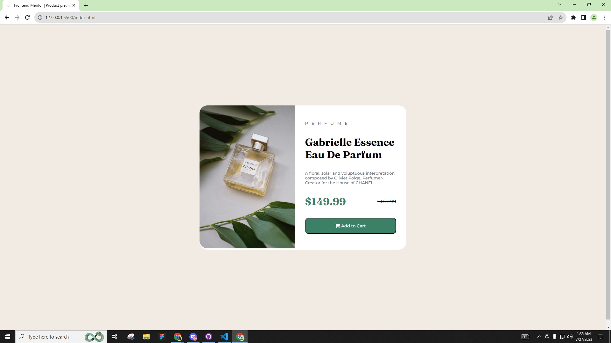

# Frontend Mentor - Product preview card component solution

This is a solution to the [Product preview card component challenge on Frontend Mentor](https://www.frontendmentor.io/challenges/product-preview-card-component-GO7UmttRfa). Frontend Mentor challenges help you improve your coding skills by building realistic projects. 

## Table of contents

- [Frontend Mentor - Product preview card component solution](#frontend-mentor---product-preview-card-component-solution)
  - [Table of contents](#table-of-contents)
  - [Overview](#overview)
    - [The challenge](#the-challenge)
    - [Screenshot](#screenshot)
    - [Links](#links)
  - [My process](#my-process)
    - [Built with](#built-with)
    - [What I learned](#what-i-learned)
  - [Author](#author)

**Note: Delete this note and update the table of contents based on what sections you keep.**

## Overview

### The challenge

Users should be able to:

- View the optimal layout depending on their device's screen size
- See hover and focus states for interactive elements

### Screenshot



### Links

- Solution URL: [Add solution URL here](https://your-solution-url.com)
- Live Site URL: [Add live site URL here](https://your-live-site-url.com)

## My process

### Built with

- Semantic HTML5 markup
- CSS custom properties
- Flexbox
- Mobile-first workflow

### What I learned

Use this section to recap over some of your major learnings while working through this project. Writing these out and providing code samples of areas you want to highlight is a great way to reinforce your own knowledge.

To see how you can add code snippets, see below:

```html
<div class="rightDiv">
  <h3 class="product">PERFUME</h3>
  <h2 class="product-name">Gabrielle Essence Eau De Parfum</h2>
  <p class="product-desc">A floral, solar and voluptuous interpretation composed by Olivier Polge, Perfumer-Creator for the House of CHANEL.</p>
  <div class="price">
    <h1 class="new-price">$149.99</h1>
    <h4 class="old-price">$169.99</h4>
  </div>
  <button type="submit" class="submit-btn"><i class="fa-solid fa-cart-shopping"></i> Add to Cart</button>
</div>
```
```css
@media only screen and (max-width: 375px) {
.container {
    margin: 1rem;
  }

  .wrapper {
    flex-direction: column;
  }

  .leftDiv,
  .rightDiv {
    order: 2;
  }

  .leftDiv img {
    width: 100%; /* Adjust the width to fit the container */
    border-radius: 25px 25px 0 0; /* Update the border-radius for the top corners */
  }

  .rightDiv {
    padding: 1rem;
    height: auto; /* Allow the height to adjust based on content */
  }

  .rightDiv .product,
  .rightDiv .product-name,
  .rightDiv .product-desc  {
    margin: 0.5rem 0;
  }

  .price {
    justify-content: flex-start;
    gap: 1rem;
    margin: 1rem 0;
  }

  .price .new-price {
    font-size: 1.5rem; /* Reduce the font size for better fit */
  }

  /* Change the image source for mobile */
  .leftDiv img {
    content: url("images/image-product-mobile.jpg");
  }
```

## Author

- Website - [Rovic Balingbing Github](https://github.com/rovicbalingbing)
- Frontend Mentor - [@rovicbalingbing](https://www.frontendmentor.io/profile/rovicbalingbing)
- Twitter - [@roscidDreaming](https://www.twitter.com/roscidDreaming)
